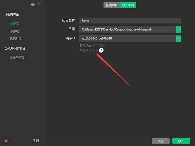

<!--
 * @Date: 2020-11-13 20:21:11
 * @LastEditors: Vinting
 * @LastEditTime: 2020-11-13 21:03:16
-->
# 部署指南
> 一下内容已Windows系统演示
## 下载代码

```bat
git clone https://github.com/vintingb/Campus-League-of-Legend.git
```

## 导入开发者工具


**注意选择测试AppID** 

## 参数修改
**AppID**
**云数据库列表**
**云储存中的图片文件**
**程序中调用云储存文件的连接**

## 云函数部署
所有云函数需要部署

updateUser
> 生成虚拟英雄数据

login
> 获取用户openid


match
> 根据互补匹配原则匹配

randomMatch
> 随机匹配

getAllUser
> 获取所有虚拟用户数据

## 外部服务
**无**

## 云函数数据库创建
user
> 储存所有虚拟英雄数据

swiper-images
> 储存动图列表

articles
> 储存结束页面数据

matchHistory
> 储存匹配历史数据

competitionList
> 储存英雄会列表数据

**具体数据去[json](example/json)查看**

## 云储存上传文件
- background文件夹下主要储存背景
- images文件夹下主要储存用户头像
- icon文件夹下主要英雄会图片
- instruction文件夹下主要主页的四个背景

## 后台配置服务
**无**
