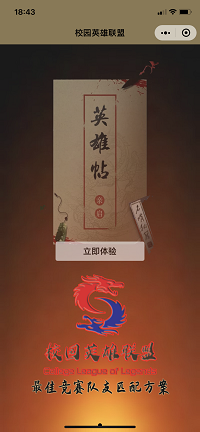
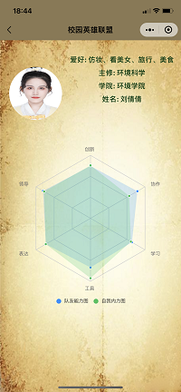

<!--
 * @Date: 2020-11-13 18:37:57
 * @LastEditors: Vinting
 * @LastEditTime: 2020-11-13 20:14:38
-->
# Campus-League-of-Legend
## 项目名称
校园英雄联盟(Campus-League-of-Legend)
## 项目介绍
> 校园英雄联盟里,每个人都被虚拟为一个英雄,小程序的主要功能就是让英雄们组队的参加英雄会

## 项目效果截图

### 项目二维码

- 微信app

### 项目体验二维码

## 部署方法

具体查看部署方法[deployment.md](deployment)

## 关于作者

* **Vintingb** - *后端兼部分前端* - [Vintingb](https://github.com/vintingb)

## 授权协议

这个项目 Apache-2.0 License 协议， 请点击 [LICENSE.md](LICENSE) 了解更多细节。

## 感谢
[uCharts](https://gitee.com/uCharts/uCharts)